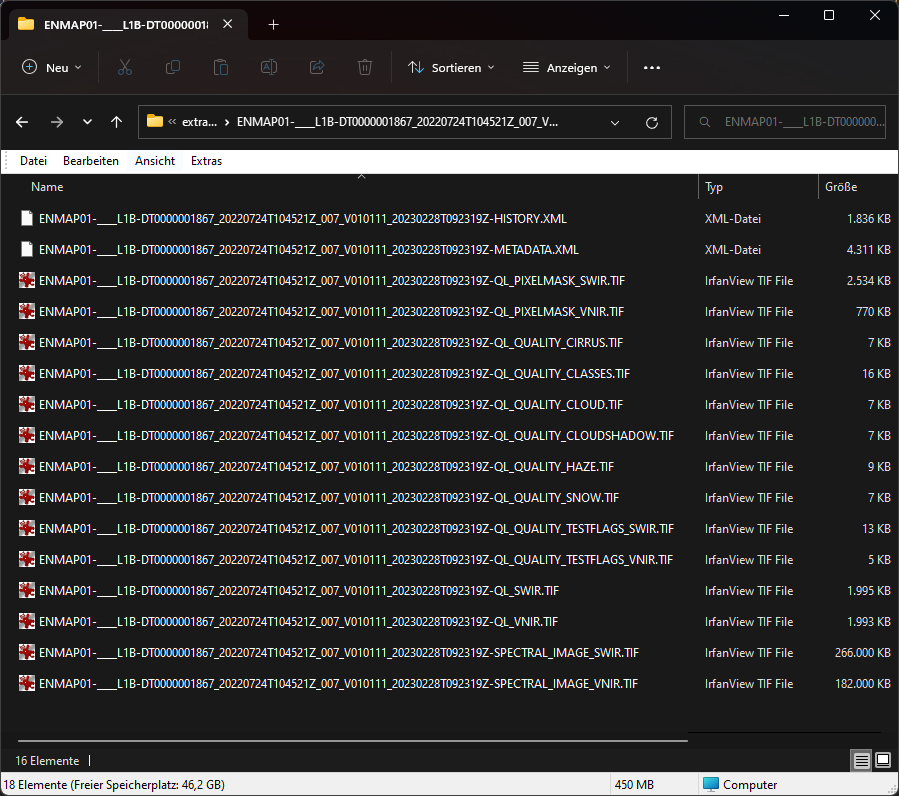
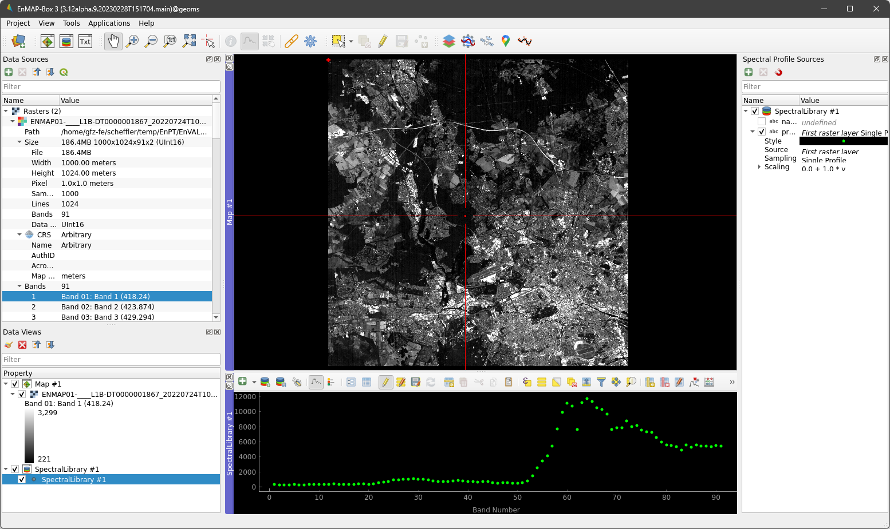
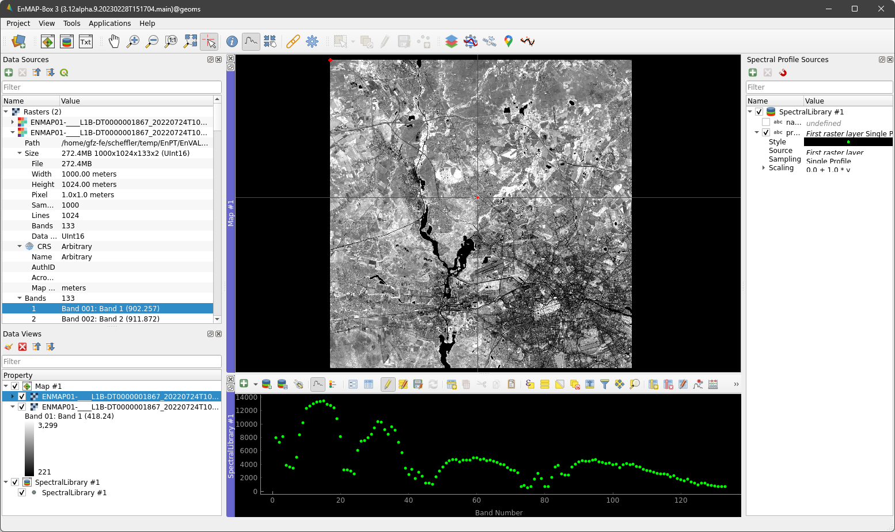
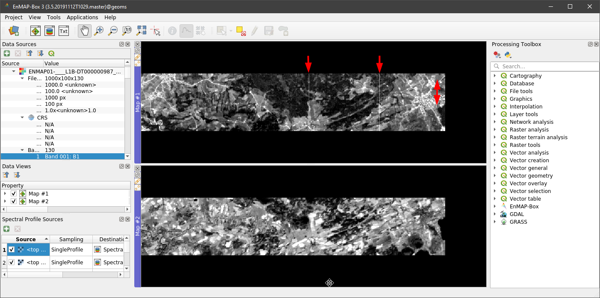
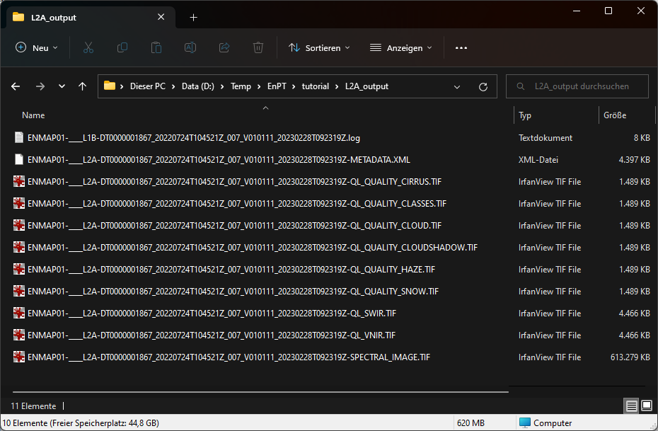
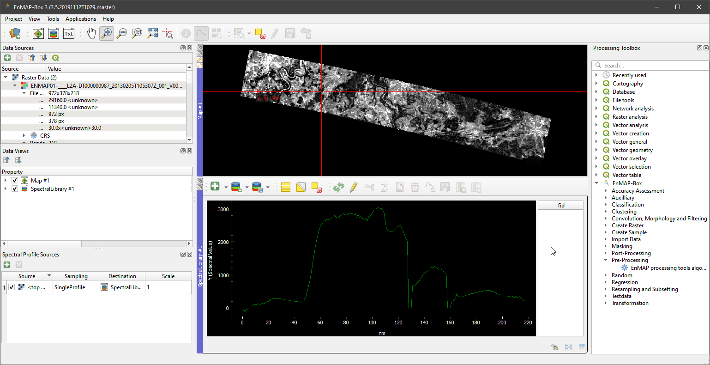

Tutorial
========

From EnMAP Level-1B to Level-2A
*******************************

In this tutorial, we generate EnMAP_ Level-2A from Level-1B data using the EnMAP processing tool (EnPT_).
Please refer to the overview about EnMAP data products `here <https://www.enmap.org/mission/dataproducts/>`__ to learn
more about the differences between EnMAP processing levels.

As described in the :ref:`usage` section of this documentation, the input parameters of EnPT_ can be set using the
Python application programming interface (API), the command line interface (CLI) or the graphical userface (GUI) within
the EnMAP-Box_ in QGIS_. In this tutorial, we will use the GUI for simplicity. More information about the GUI can be
found `here <https://git.gfz-potsdam.de/EnMAP/GFZ_Tools_EnMAP_BOX/enpt_enmapboxapp>`__.

.. _EnPT: https://git.gfz-potsdam.de/EnMAP/GFZ_Tools_EnMAP_BOX/EnPT
.. _EnMAP: https://www.enmap.org/
.. _EnMAP-Box: https://www.enmap.org/data_tools/enmapbox/
.. _QGIS: https://www.qgis.org

Requirements
------------

Software
""""""""

This tutorial requires some software to be installed on your machine:

    - QGIS_ and the EnMAP-Box_
      (see `here <https://enmap-box.readthedocs.io/en/latest/usr_section/usr_installation.html>`__
      for installation instructions)
    - EnPT_ (see `here <https://enmap.git-pages.gfz-potsdam.de/GFZ_Tools_EnMAP_BOX/EnPT/doc/installation.html>`__
      for installation instructions)
    - `EnPT EnMAP-Box App (GUI)`_ (see `here
      <https://enmap.git-pages.gfz-potsdam.de/GFZ_Tools_EnMAP_BOX/enpt_enmapboxapp/doc/installation.html>`__
      for installation instructions)

.. _`EnPT EnMAP-Box App (GUI)`: https://git.gfz-potsdam.de/EnMAP/GFZ_Tools_EnMAP_BOX/enpt_enmapboxapp

Data
""""

You can download the input data for this tutorial
`here <https://git.gfz-potsdam.de/EnMAP/GFZ_Tools_EnMAP_BOX/EnPT/-/tree/master/tests/data/
EnMAP_Level_1B/ENMAP01-____L1B-DT000000987_20130205T105307Z_001_V000101_20190426T143700Z__rows0-99.zip>`__.

Inspect the Level-1B data
-------------------------

The downloaded zip-archive contains a subset of an EnMAP Level-1B dataset covering a rural region in Bavaria, Germany.

Extract the zip-archive on your local disk and inspect the extracted files. An explanation of all the contained files
is given `here <https://git.gfz-potsdam.de/EnMAP/GFZ_Tools_EnMAP_BOX/EnPT/-/tree/master/tests/data/>`__.

.. note::

    The contents of this zip-archive may change in future.

Open QGIS_, start the EnMAP-Box_ and load the :file:`ENMAP*L1B*-SPECTRAL_IMAGE_VNIR.TIF` and
:file:`ENMAP*L1B*-SPECTRAL_IMAGE_SWIR.TIF` image datasets. Some
general handling instructions regarding the EnMAP-Box_ are given in `Exercise A of the EnMAP-Box tutorials`_.

.. _`Exercise A of the EnMAP-Box tutorials`: https://enmap-box.readthedocs.io/en/latest/usr_section/application_tutorials/urban_unmixing/tutorial.html#exercise-a-urban-land-cover

Unfold the respective entries in the **Data sources** panel to explore some metadata of both images. Both images have
1000 x 100 pixels in x- and y-direction. The VNIR image contains 88 and the SWIR contains 130 spectral bands. Both
images have no coordinate reference system (CRS). This is because EnMAP Level-1B data are provided in sensor geometry.

To visualize the first spectral band of the VNIR hyperspectral image, unfold the **Bands** entry of the VNIR image in
the **Data sources** tab, right-click on **Band 01:B1** and press **Open in new map**. Then click the Spectral Library
icon in the EnMAP-Box toolbar to open a new Spectral Library window and click somewhere into the visualized image in
the **Map** window. This makes the corresponding spectral signature show up in the **Spectral Library** window.

Open the first band of the SWIR image and visualize any SWIR spectral signature as described above.

With regard to the spectral signature plot, it is noted that EnMAP Level-1B data contain top-of-atmosphere radiance
spectra, with each spectral band scaled according to specific gain and offset values given in the image metadata.
The visualized spectra can therefore NOT directly be interpreted as top-of-atmosphere radiance but must first be
converted. Even if all bands were equally scaled, the spectra would not be comparable to other hyperspectral EO data
because they are still affected by numerous spatio-temporal varying effects, e.g., originating from the atmospheric
state at the acquisition time.

Right-click into Map #1 and press **Link with other maps**. Then zoom into the image and compare the VNIR and SWIR
images. At this point, a spatial offset between both images is clearly visible which means that the spectral
information of both EnMAP detectors cannot be interpreted together. Panning through the image also reveals some
vertical striping effects, i.e., dead image columns.

To sum up, EnMAP Level-1B data cannot be directly used for downstream remote sensing applications due to the following
reasons:

    - separate VNIR and SWIR detector images
    - images provided in sensor geometry, i.e., without coordinate reference system (CRS)
    - spectral information represents top-of-atmosphere radiance, separately scaled for each band
    - VNIR and SWIR images do not show the same spatial extent (offsets in along- and across-track direction)
    - image artefacts such as vertical striping due to dead pixels
    - spectral information is affected by various spatio-temporal effects, e.g., originating from the atmospheric state
    - some sensor-induced effects that are not directly visible (spectral smile, keystone, ...)

Generate Level-2A data using EnPT
---------------------------------

The EnMAP processing tool (EnPT) generates Level-2A from Level-1B data, i.e., processes the EnMAP data from the
raw format to geometrically and atmospherically corrected bottom-of-atmosphere reflectance. Please refer to the
:ref:`algorithm_description` section of this documentation for more information on the underlying algorithms.

Open the EnPT GUI to run the processing chain. You can find it here:
:menuselection:`QGIS 3.xx --> EnMAP-Box --> Processing Toolbox --> EnMAP-Box --> Pre-Processing --> EnMAP processing tool algorithm`.

.. image:: img/screenshot_enpt_enmapboxapp_v0.6.0.png

Select the :file:`ENMAP01-____L1B-DT000000987_20130205T105307Z_001_V000101_20190426T143700Z__rows0-99.zip` downloaded
above at the parameter **L1B EnMAP image** and check that the **Anaconda root directory** points to the correct
Anaconda directory which contains the `enpt` Python environment (see :ref:`installation`). All other parameters are
set to a default or not strictly needed to generate Level-2A data. However, they may improve the output quality.

Press the **Run** button to start the processing. The current status is shown in the **Log** panel and the QGIS Python
console. After processing, the output directory is indicated in the Log panel.

Inspect the Level-2A data and compare them with Level-1B
--------------------------------------------------------

The output folder contains the EnMAP Level-2A image data :file:`ENMAP*L2A*-SPECTRAL_IMAGE.TIF` and a couple of
other files, such as metadata, quality layers, etc.:

.. note::

    The output directory will contain additional layers in future.

Load the :file:`ENMAP*L2A*-SPECTRAL_IMAGE.TIF` into
the EnMAP-Box_. Unfold the entry in the **Data sources** panel to explore some metadata of the Level-2A EnMAP-image.
The image has a dimension of 972 x 378 pixels in x- and y-direction and contains 218 bands. The different image
dimensions compared with Level-1B data are due to the geometric correction / orthorectification applied by EnPT.
Furthermore, the image is now projected in WGS84 / UTM zone 32N.

Visualize the first band of the image and open a Spectral Library window as described above. The spectral information
now contains atmospherically corrected bottom-of-atmosphere reflectance data. The two detector images have been merged
so that their spectral information can now be used together. Spatio-temporal varying interferences on the spectra have
been corrected as far as possible.

The generated EnMAP Level-2A data can now be used for subsequent remote sensing applications.
