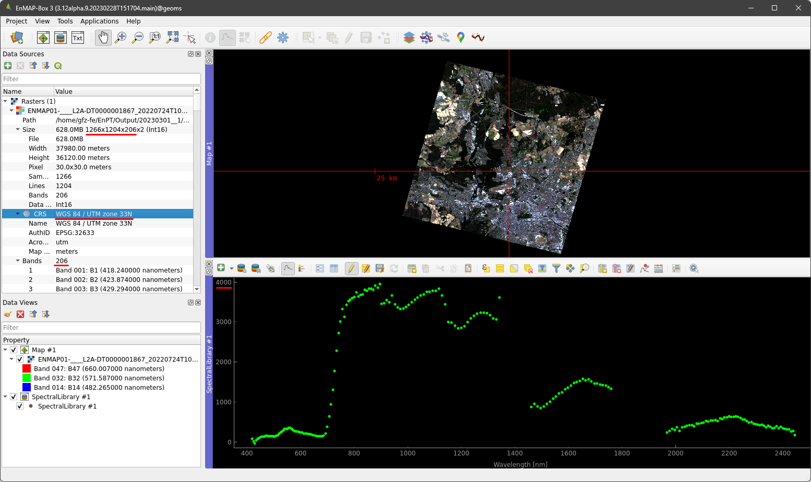

Tutorial
========

From EnMAP Level-1B to Level-2A
*******************************

In this tutorial, we generate EnMAP_ Level-2A from Level-1B data using the EnMAP processing tool (EnPT_).
Please refer to the overview about EnMAP data products `here <https://www.enmap.org/data_access/>`__ to learn
more about the differences between EnMAP processing levels.

As described in the :ref:`usage` section of this documentation, the input parameters of EnPT_ can be set using the
Python application programming interface (API), the command line interface (CLI) or the graphical userface (GUI) within
the EnMAP-Box_ in QGIS_. In this tutorial, we will use the GUI for simplicity. More information about the GUI can be
found `here <https://git.gfz-potsdam.de/EnMAP/GFZ_Tools_EnMAP_BOX/enpt_enmapboxapp>`__.

.. _EnPT: https://git.gfz-potsdam.de/EnMAP/GFZ_Tools_EnMAP_BOX/EnPT
.. _EnMAP: https://www.enmap.org/
.. _EnMAP-Box: https://www.enmap.org/data_tools/enmapbox/
.. _QGIS: https://www.qgis.org

Requirements
------------

Software
""""""""

This tutorial requires some software to be installed on your machine:

    - QGIS_ and the EnMAP-Box_
    - EnPT_
    - `EnPT EnMAP-Box App (GUI)`_

Please see `here <https://enmap.git-pages.gfz-potsdam.de/GFZ_Tools_EnMAP_BOX/EnPT/doc/installation.html#installing-enpt-along-with-qgis-and-the-enmap-box-backend-gui>`__
for a description to install all together into a single MambaForge Conda environment.

.. _`EnPT EnMAP-Box App (GUI)`: https://git.gfz-potsdam.de/EnMAP/GFZ_Tools_EnMAP_BOX/enpt_enmapboxapp

Data
""""

You can download a subset of an EnMAP Level-1B dataset from
`here <https://git.gfz-potsdam.de/EnMAP/GFZ_Tools_EnMAP_BOX/EnPT/-/tree/master/tests/data/
EnMAP_Level_1B/ENMAP01-____L1B-DT000000987_20130205T105307Z_001_V000101_20190426T143700Z__rows0-99.zip>`__,
which can be used to reproduce this tutorial. However, the actual EnMAP dataset that was used for this tutorial is
not contained in the EnPT repository due to its file size.

Inspect the Level-1B data
-------------------------

The EnMAP L1B zip-archive used for this tutorial contains an acquisition covering Berlin and the surrounding area.

Extract the zip-archive on your local disk and inspect the extracted files. An explanation of all the contained files
is given `here <https://enmap.git-pages.gfz-potsdam.de/GFZ_Tools_EnMAP_BOX/EnPT/doc/algorithm_descriptions.html#enmap-level-1b-data-reader>`__.

.. image:: img/tut__contents_test_dataset.png

.. note::

    The contents of this zip-archive may change in future.

    Depending on the data format in which the Level-1B data was ordered from the ground segment,
    the raster data may also have different file extensions such as :file:`*.BSQ`.

Open QGIS_, start the EnMAP-Box_ and load the :file:`ENMAP*L1B*-SPECTRAL_IMAGE_VNIR.TIF` and
:file:`ENMAP*L1B*-SPECTRAL_IMAGE_SWIR.TIF` image datasets. Some
general handling instructions regarding the EnMAP-Box_ are given in `Exercise A of the EnMAP-Box tutorials`_.

.. _`Exercise A of the EnMAP-Box tutorials`: https://enmap-box.readthedocs.io/en/latest/usr_section/application_tutorials/urban_unmixing/tutorial.html#exercise-a-urban-land-cover

Unfold the respective entries in the **Data sources** panel to explore some metadata of both images. Both images have
1000 x 1024 pixels in x- and y-direction. The VNIR image contains 91 and the SWIR contains 133 spectral bands. Both
images have no coordinate reference system (Arbitrary CRS). This is because EnMAP Level-1B data are provided in sensor
geometry.

To visualize the first spectral band of the VNIR hyperspectral image, unfold the **Bands** entry of the VNIR image in
the **Data sources** tab, right-click on **Band 01:Band 1 (418.24)** and press **Open in new map**. Then click the
Spectral Library icon in the EnMAP-Box toolbar to open a new Spectral Library window and click somewhere into the
visualized image in the **Map** window. This makes the corresponding spectral signature show up in the
**Spectral Library** window.

Open the first band of the SWIR image and visualize any SWIR spectral signature as described above.

.. image:: img/tut__enmapbox_l1b_swir.png

With regard to the spectral signature plot, it is noted that EnMAP Level-1B data contain top-of-atmosphere radiance
spectra, with each spectral band scaled according to specific gain and offset values given in the image metadata.
The visualized spectra can therefore NOT directly be interpreted as top-of-atmosphere radiance but must first be
converted. Even if all bands were equally scaled, the spectra would not be comparable to other hyperspectral EO data
because they are still affected by numerous spatio-temporal varying effects, e.g., originating from the atmospheric
state at the acquisition time.

Now open the VNIR and SWIR images in two different map views. Right-click into Map #1 and press
**Link with other maps**. Then zoom into the image and compare the VNIR and SWIR images. At this point, a spatial
offset between both images (around 20 pixels along-track and <1 pixel across-track) is clearly visible which means that
the spectral information of both EnMAP detectors cannot be interpreted together. Panning through the image also reveals
some vertical striping effects.

To sum up, EnMAP Level-1B data cannot be directly used for downstream remote sensing applications due to the following
reasons:

    - separate VNIR and SWIR detector images
    - images provided in sensor geometry, i.e., without coordinate reference system (CRS)
    - spectral information represents top-of-atmosphere radiance, separately scaled for each band
    - VNIR and SWIR images do not show the same spatial extent (offsets in along- and across-track direction)
    - image artefacts such as vertical striping
    - spectral information is affected by various spatio-temporal effects, e.g., originating from the atmospheric state
    - some sensor-induced effects that are not directly visible (spectral smile, keystone, ...)

.. note::

    The EnMAP-Box features a tool to import EnMAP Level-1B data
    (:menuselection:`EnMAP-Box --> Project Menu --> Add product --> EnMAP L1B`)
    which directly applies scales and offsets to each band and adds some metadata such as central wavelength positions.
    This is convenient as the data is directly shown in radiance units. However, users should keep in mind that the
    actual (scaled) L1B pixel values are different as they are stretched to the unsigned integer 16-bit value range.

Generate Level-2A data using EnPT
---------------------------------

The EnMAP processing tool (EnPT) generates Level-2A from Level-1B data, i.e., processes the EnMAP data from the
raw format (top-of-atmosphere radiance in sensor geometry) to geometrically and atmospherically corrected
bottom-of-atmosphere reflectance. Please refer to the :ref:`algorithm_description` section of this documentation for
more information on the underlying algorithms.

Open the EnPT GUI to run the processing chain. You can find it here:
:menuselection:`QGIS 3.xx --> EnMAP-Box --> Applications Menu --> EnPT (EnMAP Processing Tool) --> Start EnPT GUI`.

Select the EnMAP L1B zip-archive (:file:`ENMAP01-____L1B*.ZIP`) at the parameter **L1B EnMAP image**. All other
parameters are set to a default or not strictly needed to generate Level-2A data. However, they may improve the output
quality. Documentation about the parameters is provided
`here <https://enmap.git-pages.gfz-potsdam.de/GFZ_Tools_EnMAP_BOX/EnPT/doc/usage.html#command-line-utilities>`__.

Press the **Run** button to start the processing. The current status is shown in the **Log** panel and the QGIS Python
console. After processing, the output directory is indicated in the Log panel.

Inspect the Level-2A data and compare them with Level-1B
--------------------------------------------------------

The output folder contains the EnMAP Level-2A image data :file:`ENMAP*L2A*-SPECTRAL_IMAGE.TIF` and a couple of
other files, such as metadata, quality layers, etc.:

.. image:: img/tut__contents_l2a_output.png

For descriptions of the individual files, see `here <https://enmap.git-pages.gfz-potsdam.de/GFZ_Tools_EnMAP_BOX/EnPT/doc/algorithm_descriptions.html#enmap-level-2a-data-writer>`__.

.. note::

    The output directory will contain additional layers in future.

Load the :file:`ENMAP*L2A*-SPECTRAL_IMAGE.TIF` into
the EnMAP-Box_. Unfold the entry in the **Data sources** panel to explore some metadata of the Level-2A EnMAP-image.
The image has a dimension of 1266 x 1204 pixels in x- and y-direction and contains 206 bands. The different image
dimensions compared with Level-1B data are due to the geometric correction / orthorectification applied by EnPT.
Furthermore, the image is now projected in WGS84 / UTM zone 33N.

Right-click on the image in the **Data Sources** panel and select :menuselection:`Open in new map --> True Color` to
visualize an RGB band combination and open a Spectral Library window as described above. The spectral information
now contains atmospherically corrected bottom-of-atmosphere reflectance data (scaled between 0 and 10000 by default).
The two detector images have been merged so that their spectral information can now be used together. Spatio-temporal
varying interferences on the spectra have been corrected as far as possible.

The generated EnMAP Level-2A data can now be used for subsequent remote sensing applications.

.. note::

    Also for EnMAP Level 2A data, the EnMAP-Box provides a convenient data import dialog
    (:menuselection:`EnMAP-Box --> Project Menu --> Add product --> EnMAP L2A`) which scales the EnPT L2A
    output between 0 and 1.
