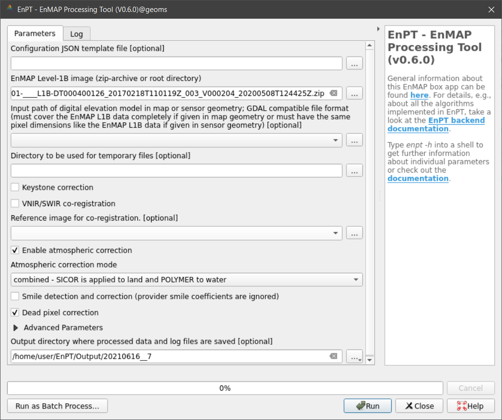

.. _usage:

Usage
=====

Usage of the Python API
***********************

**Run the whole pipeline at once**

To run the whole EnPT processing pipeline via the Python API:

.. code-block:: python

    from enpt.execution.controller import EnPT_Controller

    config_minimal = dict(
        path_l1b_enmap_image='/path/ENMAP*L1B*.zip',
        path_dem='/path/to/overlapping/DEM.bsq'
    )
    CTR = EnPT_Controller(**config_minimal)
    CTR.run_all_processors()

Further *configuration parameters* are documented
`here <https://enmap.git-pages.gfz-potsdam.de/GFZ_Tools_EnMAP_BOX/EnPT/doc/enpt.options.html#enpt.options.config.EnPTConfig>`__.
Note that the class `EnPTConfig` takes the same keyword arguments like the `EnPT_Controller` class.

You can also pass a *JSON-File with your EnPT configuration* to the `EnPT_Controller` class. This allows you to easily
copy and reuse configuration files. A template with all possible options and defaults can be found in
`enpt/options/options_default.json`_.

The corresponding Python call looks like this:

.. code-block:: python

    from enpt.execution.controller import EnPT_Controller
    from enpt.options.config import EnPTConfig

    CFG = EnPTConfig(json_config='/path/to/your/config_file.json')
    CTR = EnPT_Controller(config=CFG)
    CTR.run_all_processors()

**Run each processor module separately**

To run the different processor modules separately, follow the instructions below.
Note, that the processors are built on each other, so the order must be unchanged.

1. To get an instance of *EnPT_Controller*:

   .. code-block:: python

      CTR = EnPT_Controller(**your_config_parameters)  # config parameters are described above

2. *Read the EnMAP Level-1B data* into memory, convert DNs to radiance and compute coordiante layers:

   .. code-block:: python

      CTR.read_L1B_data()

   Get the in-memory Python object representing the Level-1 dataset (NOTE: the attributes and methods of this
   Python object are documented
   `here <https://enmap.git-pages.gfz-potsdam.de/GFZ_Tools_EnMAP_BOX/EnPT/doc/enpt.model.html#enpt.model.images.EnMAPL1Product_SensorGeo>`__):

   .. code-block:: python

      L1_obj = CTR.L1_obj

3. To correct *dead pixels*:

   .. code-block:: python

      CTR.L1_obj.correct_dead_pixels()

4. *reflectance* conversion

   To run the *atmospheric correction* using SICOR_:

   .. code-block:: python

      CTR.run_atmospheric_correction()

   To run convert top-of-atmosphere radiance to *top-of-atmosphere reflectance* (as an alternative to atmospheric correction):

   .. code-block:: python

      CTR.run_toaRad2toaRef()

5. To compute *spatial misregistration* with respect to a user-provided reference dataset
   (NOTE: This feature is yet implemented):

   .. code-block:: python

      CTR.run_geometry_processor()

6. To run the *orthorectification*:

   .. code-block:: python

      self.run_orthorectification()

   From now on, you may get the in-memory EnMAP Level-2 Python object (attributes and methods are documented
   `here <https://enmap.git-pages.gfz-potsdam.de/GFZ_Tools_EnMAP_BOX/EnPT/doc/enpt.model.html#enpt.model.images.EnMAPL2Product_MapGeo>`__):

   .. code-block:: python

      L2_obj = CTR.L2_obj

7. To *write the EnMAP Level-2 data* to disk:

   .. code-block:: python

      L2_obj = CTR.write_output()

----

Command line utilities
**********************

enpt
----

At the command line, EnPT provides the **enpt** command:

.. argparse::
   :filename: ./../enpt/cli.py
   :func: get_enpt_argparser
   :prog: enpt

----

QGIS GUI
********

There is a separate graphical user interface (GUI) for EnPT than can be installed as an EnMAP-Box application in QGIS.
To install it in QGIS, please refer to the separate repository enpt_enmapboxapp_.

Here is screenshot of the current version:

.. _enpt_enmapboxapp: https://git.gfz-potsdam.de/EnMAP/GFZ_Tools_EnMAP_BOX/enpt_enmapboxapp
.. _enpt/options/options_default.json: https://git.gfz-potsdam.de/EnMAP/GFZ_Tools_EnMAP_BOX/EnPT/blob/master/enpt/options/options_default.json
.. _SICOR: https://git.gfz-potsdam.de/EnMAP/sicor