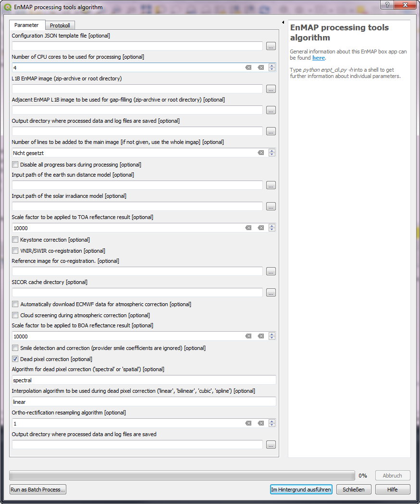

Usage
=====

Usage of the Python API
***********************

To start run whole EnPT processing pipeline via the Python API::

    from enpt.execution.controller import EnPT_Controller

    config_minimal = dict(
        path_l1b_enmap_image='/path/ENMAP*L1B*.zip',
        path_dem='/path/to/overlapping/DEM.bsq'
    )
    CTR = EnPT_Controller(**config_minimal)
    CTR.run_all_processors()

Further configuration parameters are here_. Note that the class 'EnPT_Config' takes the same keyword arguments like the
'EnPT_Controller' class.

.. _here: http://enmap.gitext.gfz-potsdam.de/GFZ_Tools_EnMAP_BOX/EnPT/doc/enpt.options.html#enpt.options.config.EnPTConfig

Command line utilities
**********************

enpt_cli.py
-----------

At the command line, EnPT provides the **enpt_cli.py** command:

.. argparse::
   :filename: ./../bin/enpt_cli.py
   :func: get_enpt_argparser
   :prog: enpt_cli.py

QGIS GUI
********

There is a separate graphical user interface (GUI) for EnPT than can be installed as an EnMAP-Box application in QGIS.
To install it in QGIS, please refer to the separate repository enpt_enmapboxapp_.

Here is screenshot of the current version:

.. _enpt_enmapboxapp: https://gitext.gfz-potsdam.de/EnMAP/GFZ_Tools_EnMAP_BOX/enpt_enmapboxapp